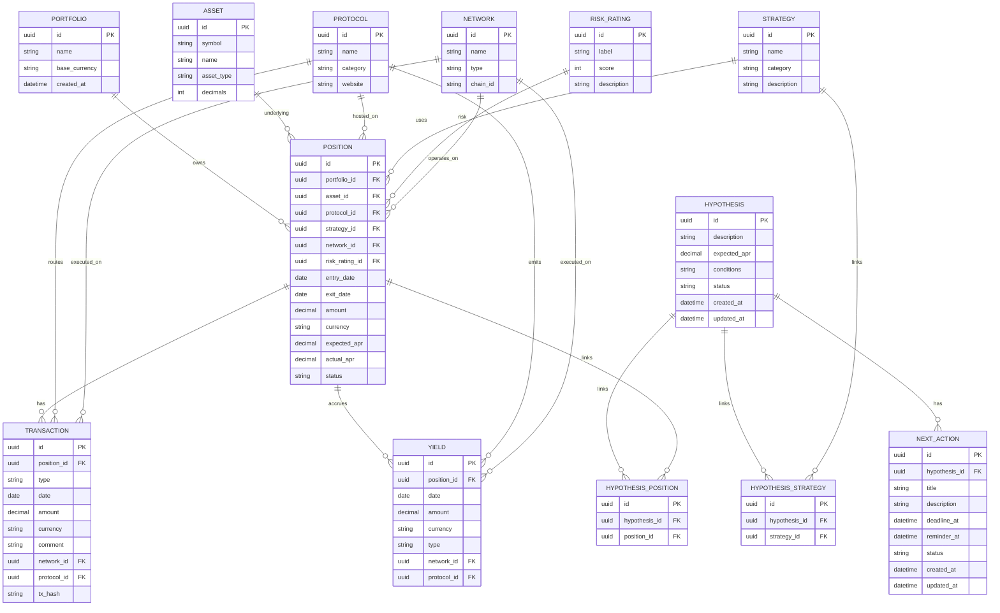

# Data model

Документ фиксирует ключевые сущности, обязательные поля и связи для трекера портфеля.

## 1. Ключевые сущности

### Portfolio
Набор позиций и стратегий пользователя.

### Position (Investment)
Единица инвестиций в конкретный актив/протокол/стратегию с входом и выходом.

### Transaction (IN/OUT)
Движение средств по позиции: ввод (IN) или вывод (OUT).
Хранит дату, сумму, валюту и комментарий операции, а также связь с позицией.

### Yield/Income
Начисленный доход (проценты, награды, комиссии) по позиции.

### Strategy
Инвестиционная стратегия (например, стейкинг, лендинг, LP, фарминг).

### Hypothesis
Инвестиционная гипотеза с описанием ожидаемой доходности и условиями.

### NextAction
Следующее действие по гипотезе с дедлайном и напоминаниями.

### Asset
Торгуемый актив или токен (например, USDC, ETH).

### Protocol
Платформа/протокол, где размещается позиция (например, Aave, Lido, Binance).

### RiskRating
Оценка риска (например, Low/Medium/High) для позиции, стратегии или протокола.

### Region/Network
Регион или сеть исполнения (например, Ethereum, Arbitrum, BSC; или географический регион для брокеров).

## 2. Обязательные поля (минимальный набор)

> Поля помечены как **required**; дополнительные поля могут расширяться при реализации.

### Portfolio
- **id**
- **name**
- **base_currency** (валюта учёта, например USD)
- **created_at**

### Position (Investment)
- **id**
- **portfolio_id**
- **asset_id**
- **protocol_id**
- **strategy_id**
- **network_id**
- **risk_rating_id**
- **entry_date** (дата входа)
- **exit_date** (дата выхода, nullable)
- **amount** (текущий/входной размер позиции)
- **currency** (валюта количества, обычно = asset.symbol)
- **expected_apr** (ожидаемый APR)
- **actual_apr** (фактический APR)
- **status** (open/closed)

### Transaction (IN/OUT)
- **id**
- **position_id**
- **type** (IN | OUT)
- **date**
- **amount**
- **currency**
- **comment** (опционально, описание операции)
- **network_id**
- **protocol_id**
- **tx_hash** (опционально для on-chain)

### Yield/Income
- **id**
- **position_id**
- **date**
- **amount**
- **currency**
- **type** (interest/reward/fee/other)
- **network_id**
- **protocol_id**

### Strategy
- **id**
- **name**
- **category** (staking/lending/liquidity/farming/etc.)
- **description**

### Hypothesis
- **id**
- **description** (краткое описание гипотезы)
- **expected_apr** (ожидаемый APR)
- **conditions** (условия входа/валидации гипотезы)
- **status** (draft/active/validated/invalidated/archived)
- **created_at**
- **updated_at**

### HypothesisPosition (связь Hypothesis ↔ Position)
- **id**
- **hypothesis_id**
- **position_id**

### HypothesisStrategy (связь Hypothesis ↔ Strategy)
- **id**
- **hypothesis_id**
- **strategy_id**

### NextAction
- **id**
- **hypothesis_id**
- **title**
- **description** (опционально)
- **deadline_at** (дедлайн выполнения)
- **reminder_at** (дата/время напоминания)
- **status** (open/done/cancelled)
- **created_at**
- **updated_at**

### Asset
- **id**
- **symbol**
- **name**
- **asset_type** (token/coin/stock/bond/etc.)
- **decimals** (для токенов)

### Protocol
- **id**
- **name**
- **category** (cex/dex/lending/staking/etc.)
- **website**

### RiskRating
- **id**
- **label** (Low/Medium/High/...)
- **score** (числовая шкала, например 1–5)
- **description**

### Region/Network
- **id**
- **name** (Ethereum, Arbitrum, EU, US)
- **type** (network/region)
- **chain_id** (для сетей)

## 3. ER-схема (Mermaid)



## 4. JSON-схема (прототип)

Ниже — минимальные схемы для основных сущностей. Это черновой прототип для обсуждения.

```json
{
  "$schema": "http://json-schema.org/draft-07/schema#",
  "definitions": {
    "Portfolio": {
      "type": "object",
      "required": ["id", "name", "base_currency", "created_at"],
      "properties": {
        "id": {"type": "string", "format": "uuid"},
        "name": {"type": "string"},
        "base_currency": {"type": "string"},
        "created_at": {"type": "string", "format": "date-time"}
      }
    },
    "Position": {
      "type": "object",
      "required": [
        "id",
        "portfolio_id",
        "asset_id",
        "protocol_id",
        "strategy_id",
        "network_id",
        "risk_rating_id",
        "entry_date",
        "amount",
        "currency",
        "expected_apr",
        "actual_apr",
        "status"
      ],
      "properties": {
        "id": {"type": "string", "format": "uuid"},
        "portfolio_id": {"type": "string", "format": "uuid"},
        "asset_id": {"type": "string", "format": "uuid"},
        "protocol_id": {"type": "string", "format": "uuid"},
        "strategy_id": {"type": "string", "format": "uuid"},
        "network_id": {"type": "string", "format": "uuid"},
        "risk_rating_id": {"type": "string", "format": "uuid"},
        "entry_date": {"type": "string", "format": "date"},
        "exit_date": {"type": ["string", "null"], "format": "date"},
        "amount": {"type": "number"},
        "currency": {"type": "string"},
        "expected_apr": {"type": "number"},
        "actual_apr": {"type": "number"},
        "status": {"type": "string", "enum": ["open", "closed"]}
      }
    },
    "Transaction": {
      "type": "object",
      "required": [
        "id",
        "position_id",
        "type",
        "date",
        "amount",
        "currency",
        "network_id",
        "protocol_id"
      ],
      "properties": {
        "id": {"type": "string", "format": "uuid"},
        "position_id": {"type": "string", "format": "uuid"},
        "type": {"type": "string", "enum": ["IN", "OUT"]},
        "date": {"type": "string", "format": "date"},
        "amount": {"type": "number"},
        "currency": {"type": "string"},
        "comment": {"type": ["string", "null"]},
        "network_id": {"type": "string", "format": "uuid"},
        "protocol_id": {"type": "string", "format": "uuid"},
        "tx_hash": {"type": ["string", "null"]}
      }
    },
    "Yield": {
      "type": "object",
      "required": [
        "id",
        "position_id",
        "date",
        "amount",
        "currency",
        "type",
        "network_id",
        "protocol_id"
      ],
      "properties": {
        "id": {"type": "string", "format": "uuid"},
        "position_id": {"type": "string", "format": "uuid"},
        "date": {"type": "string", "format": "date"},
        "amount": {"type": "number"},
        "currency": {"type": "string"},
        "type": {"type": "string", "enum": ["interest", "reward", "fee", "other"]},
        "network_id": {"type": "string", "format": "uuid"},
        "protocol_id": {"type": "string", "format": "uuid"}
      }
    },
    "Hypothesis": {
      "type": "object",
      "required": [
        "id",
        "description",
        "expected_apr",
        "conditions",
        "status",
        "created_at",
        "updated_at"
      ],
      "properties": {
        "id": {"type": "string", "format": "uuid"},
        "description": {"type": "string"},
        "expected_apr": {"type": "number"},
        "conditions": {"type": "string"},
        "status": {
          "type": "string",
          "enum": ["draft", "active", "validated", "invalidated", "archived"]
        },
        "created_at": {"type": "string", "format": "date-time"},
        "updated_at": {"type": "string", "format": "date-time"}
      }
    },
    "HypothesisPosition": {
      "type": "object",
      "required": ["id", "hypothesis_id", "position_id"],
      "properties": {
        "id": {"type": "string", "format": "uuid"},
        "hypothesis_id": {"type": "string", "format": "uuid"},
        "position_id": {"type": "string", "format": "uuid"}
      }
    },
    "HypothesisStrategy": {
      "type": "object",
      "required": ["id", "hypothesis_id", "strategy_id"],
      "properties": {
        "id": {"type": "string", "format": "uuid"},
        "hypothesis_id": {"type": "string", "format": "uuid"},
        "strategy_id": {"type": "string", "format": "uuid"}
      }
    },
    "NextAction": {
      "type": "object",
      "required": [
        "id",
        "hypothesis_id",
        "title",
        "deadline_at",
        "reminder_at",
        "status",
        "created_at",
        "updated_at"
      ],
      "properties": {
        "id": {"type": "string", "format": "uuid"},
        "hypothesis_id": {"type": "string", "format": "uuid"},
        "title": {"type": "string"},
        "description": {"type": ["string", "null"]},
        "deadline_at": {"type": "string", "format": "date-time"},
        "reminder_at": {"type": "string", "format": "date-time"},
        "status": {"type": "string", "enum": ["open", "done", "cancelled"]},
        "created_at": {"type": "string", "format": "date-time"},
        "updated_at": {"type": "string", "format": "date-time"}
      }
    }
  }
}
```

## 5. Агрегации по позиции

Текущие агрегаты вычисляются по Transaction и (опционально) Yield, выражаются в валюте позиции
или в базовой валюте портфеля после конвертации.

- **current_deposit** — текущий депозит по позиции: сумма IN минус сумма OUT.
- **total_in** — общий вход: сумма всех транзакций типа IN.
- **total_out** — общий выход: сумма всех транзакций типа OUT.
- **net_position** — чистая позиция: current_deposit + накопленный доход (если учитываем Yield).

Формулы (без конвертации валют):

```
total_in = Σ Transaction.amount where type = IN
total_out = Σ Transaction.amount where type = OUT
current_deposit = total_in - total_out
net_position = current_deposit + Σ Yield.amount
```

## 6. UI/UX требования для операций

### Форма ввода операции
Минимальные поля:
- **date** (дата операции)
- **type** (IN/OUT)
- **amount** (сумма)
- **currency** (валюта суммы)
- **comment** (опционально)
- **position_id** (скрыто, привязка к позиции)

### История операций в карточке позиции
В карточке позиции показывается список транзакций, отсортированных по убыванию даты:
- дата
- тип (IN/OUT)
- сумма и валюта
- комментарий (если есть)
- ссылки на протокол/сеть или tx_hash (если доступно)

### Активные гипотезы и следующие действия
В интерфейсе отображается:
- список активных гипотез (status = active) с ключевыми полями: описание, expected_apr, условия
- список следующих действий (NextAction) с дедлайном и статусом выполнения
- быстрые ссылки из гипотез на связанные позиции и стратегии
